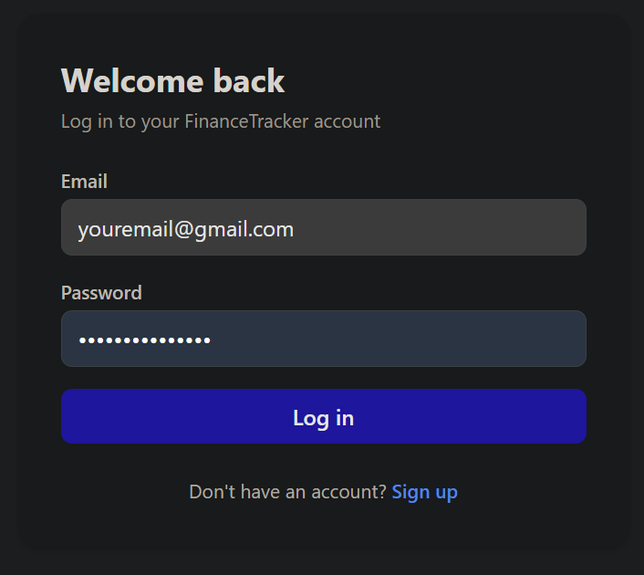
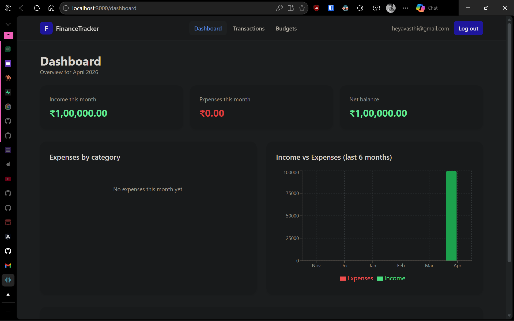
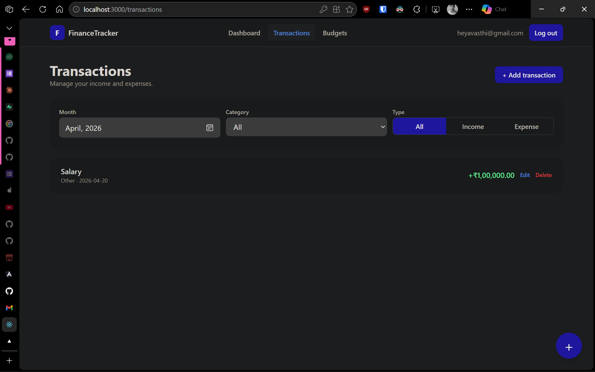
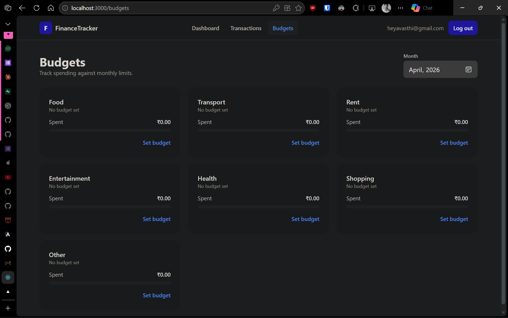

# FinanceTracker

A personal finance tracker for logging income and expenses, visualizing spending, and hitting monthly budget goals — built with React and Supabase.

---

## Problem Statement

Most people have no structured, lightweight way to track personal finances without subscribing to bloated paid apps. FinanceTracker solves this with a single, focused web app that lets any individual:

- Log every income and expense in one place
- See exactly where their money is going through clear visual breakdowns
- Set a monthly spending limit per category and watch progress in real time

Target user: anyone who wants clarity over their personal spending without signing up for an expensive finance product.

---

## Features

- Email + password authentication (Supabase Auth) with protected routes
- Dashboard with monthly income, expenses, and net-balance summary cards
- Expenses-by-category pie chart (current month)
- Income vs. expenses bar chart (last 6 months)
- Recent transactions feed on the dashboard
- Full transactions CRUD with month / category / type filters
- Floating "Add transaction" button and modal form with auto-focused title field
- Inline edit + delete (with confirmation) for every transaction
- Per-category monthly budget goals with progress bars (green → yellow → red)
- "Over budget!" warning when spending exceeds the limit
- Responsive, mobile-first Tailwind UI
- Loading spinners, empty states, and inline error messages everywhere
- Lazy-loaded routes with React Router v6 + Suspense
- Row Level Security — users can only read and write their own rows

---

## Tech Stack

| Layer              | Technology                                |
| ------------------ | ----------------------------------------- |
| Frontend Framework | React 18+ (functional components + hooks) |
| Routing            | React Router v6                           |
| Global State       | Context API (AuthContext)                 |
| Backend / Auth     | Supabase (Auth + Postgres + RLS)          |
| Styling            | Tailwind CSS                              |
| Charts             | Recharts                                  |
| Deployment         | Vercel / Netlify                          |

---

## Setup Instructions

### 1. Clone the repository

```bash
git clone https://github.com/ishanavasthi/fintracker
cd fintracker
```

### 2. Install dependencies

```bash
npm install
```

### 3. Configure environment variables

Copy the example file and fill in your Supabase credentials:

```bash
cp .env.example .env
```

Edit `.env`:

```
REACT_APP_SUPABASE_URL=your_supabase_project_url
REACT_APP_SUPABASE_ANON_KEY=your_supabase_anon_key
```

Find these values in your Supabase project dashboard under **Project Settings → API**.

### 4. Set up the database

In the Supabase SQL editor, run the schema SQL provided in the project (creates `transactions` and `budgets` tables with RLS policies).

Then, under **Authentication → Providers → Email**, disable **"Confirm email"** for local development so new signups can log in immediately.

### 5. Start the dev server

```bash
npm start
```

The app runs at [http://localhost:3000](http://localhost:3000).

### 6. Build for production

```bash
npm run build
```

---

## Folder Structure

```
finance-tracker/
├── public/
│   ├── favicon.svg
│   └── index.html
├── src/
│   ├── components/          Reusable UI (Navbar, Spinner, ErrorMessage,
│   │                        ErrorBoundary, ProtectedRoute,
│   │                        TransactionModal, BudgetModal)
│   ├── pages/               Route-level screens (Login, Signup, Dashboard,
│   │                        Transactions, Budgets, NotFound)
│   ├── hooks/               Custom hooks (useTransactions, useBudgets)
│   ├── context/             React Context providers (AuthContext)
│   ├── services/            Supabase client + data-access layer
│   │                        (supabase.js, transactions.js, budgets.js)
│   ├── constants.js         Shared constants (categories, helpers)
│   ├── App.js               Router + providers
│   └── index.js             React entry point
├── .env.example
├── .gitignore
├── package.json
├── postcss.config.js
├── tailwind.config.js
└── README.md
```

**Rules of the architecture:**

- Pages never call Supabase directly — always go through `/services`
- Hooks wrap services and expose `{ data, loading, error, refetch }`
- Components are presentational — no direct Supabase calls

---

## Screenshots

<!-- > _Screenshots coming soon._ -->

<table>
  <tr>
    <td align="center"><b>Login / Signup</b></td>
    <td align="center"><b>Dashboard</b></td>
  </tr>
  <tr>
    <td></td>
    <td></td>
  </tr>
  <tr>
    <td align="center"><b>Transactions</b></td>
    <td align="center"><b>Budgets</b></td>
  </tr>
  <tr>
    <td></td>
    <td></td>
  </tr>
</table>

---

## License

MIT
